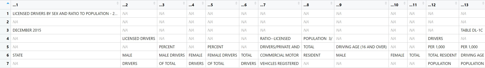
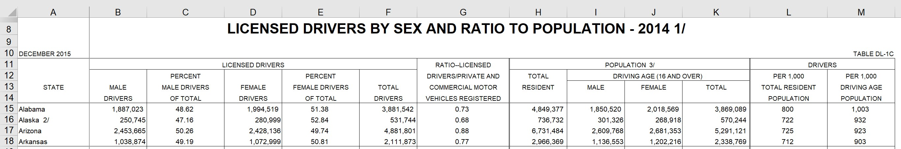

```{r setup, include=FALSE}

knitr::opts_chunk$set(echo = TRUE)

library(tidyverse)
library(magrittr)
library(readxl)
library(lubridate)
library(dplyr)
library(unpivotr)
library(here)


```


Data Cleaning:
Explain which methods you would use to clean this sample dataset, and how you would go about applying them:
DOT Age and Availability of Amtrak and Locomotive Car Fleets -https://www.bts.gov/sites/bts.dot.gov/files/table_01_33_102020.xlsx
(Webpage: https://www.bts.gov/content/age-and-availability-amtrak-locomotive-and-car-fleets)

After initial review of data in MS Excel, I see we have time series data, two groups, with two variables for each group.

We will use R and more specifically a XGBoost submodel for imputing missing values.
Import data with readxl package. Skip first row.


```{r Load Data, warning=FALSE, message=FALSE}


table_01_33_102020 <- read_excel("data/table_01_33_102020.xlsx", range = cell_rows(2:8))


```

Now we need to transform data to tidy or columnar format.
We need to gather data under two 'Categories' - "Locomotives" and "Passenger and other train Cars"


```{r Tidy Dataframe, warning=FALSE, message=FALSE}


table_amtrak <- as.data.frame(t(table_01_33_102020))


# Split data frame into two groups. 
df1 <- table_amtrak[,1:3]
df2 <- table_amtrak[,4:6]


# Pull out Date for potential Time Series Analysis
dates <- as.data.frame(row.names(df1))
dates <- as.data.frame(dates[2:35, ])
names(dates) <- "Date"


# Format Group 1 - "Locomotives"
df1[c(2:35), 1] <- df1[1,1]
df1[1,1] <- "Train_Type"

locomotives <- as.data.frame(cbind(df1[2:35, 1], df1[2:35, 2], df1[2:35, 3]))
names(locomotives) <- df1[1,]
locomotives <- cbind(locomotives, dates)

#Use for additional time series analysis
write.csv(locomotives, "data/locomotives.csv")


# Repeat for Group 2 - "Passenger Trains
df2[c(2:35), 1] <- df2[1,1]
df2[1,1] <- "Train_Type"

passenger_trains <- as.data.frame(cbind(df2[2:35, 1], df2[2:35, 2], df2[2:35, 3]))
names(passenger_trains) <- df2[1,]
passenger_trains <- cbind(passenger_trains, dates)

#Use for additional time series analysis
write.csv(passenger_trains, "data/passenger-trains.csv")


# Bring groups back together. 
trains <- rbind(locomotives, passenger_trains) 

# Final Tidy Dataframe
trains %<>% select(4,1,2,3) %>% arrange(Date)

#Use for XGBoost submodel to impute missing values
write.csv(trains, "data/trains.csv")


```


We also have missing data for one variable - 'Percent available for service'.
We train a model on available data to predict missing data with the XGBoost algorithm for convenience and accuracy.


```{r Data Wrangling Impute Missing Values, warning=FALSE, message=FALSE}

source(knitr::purl("Impute Values_XGBoost SubModel.Rmd", quiet=TRUE))

head(final_amtrak_data, 5)


```


Data Joining:
Using any software (commercial and open source) you like, programmatically join the following two untidy sample datasets:
DOT Licensed drivers--Ratio of licensed drivers to population -https://www.fhwa.dot.gov/policyinformation/statistics/2014/xls/dl1c.xls.

DOT Licensed Drivers by State, Sex, and Age Group - https://www.fhwa.dot.gov/policyinformation/statistics/2014/xls/dl22.xls.
Provide an inline image or table showing between 5-10 sample rows of your joined dataset, along the source code used to complete the above task in plain text format. Your work should be reproducible by someone with access to the original datasets and your software (commercial and open source). Explain how you programmatically joined these datasets, and what challenges you experienced in doing so.


```{r Data Joining Parent File, warning=FALSE, message=FALSE}

# Parent Data File
dl1c_data <- read_excel("data/dl1c.xls", range = cell_rows(14:66))
dl1c_data %<>% mutate_all(list(~str_replace(., "2/", "")))

# Incoming Parent Header
dl1c_headings <- read_excel("data/dl1c.xls", range = cell_rows(7:14))


```

  

```{r Image1, out.width = "100%", fig.align = "center", echo = FALSE}



```


Above is data layout after reading in via R.

Below is original excel table layout.


```{r Image2, out.width = "100%", fig.align = "center", echo = FALSE}




```


```{r Parent Header File, warning=FALSE, message=FALSE}

header_parent <- data.frame()

header_parent[1,1] <- paste("STATE")
header_parent[1,2] <- paste("LICENSED MALE DRIVERS")
header_parent[1,3] <- paste("LICENSED PERCENT MALE DRIVERS OF TOTAL")
header_parent[1,4] <- paste("LICENSED FEMALE DRIVERS")
header_parent[1,5] <- paste("LICENSED PERCENT FEMALE DRIVERS OF TOTAL")
header_parent[1,6] <- paste("LICENSED TOTAL DRIVERS")
header_parent[1,7] <- paste("RATIO LICENSED DRIVERS REGISTERED")
header_parent[1,8] <- paste("TOTAL RESIDENT POPULATION")
header_parent[1,9] <- paste("MALE POPULATION (16 AND OVER)")
header_parent[1,10] <- paste("FEMALE POPULATION (16 AND OVER)")
header_parent[1,11] <- paste("TOTAL POPULATION (16 AND OVER)")
header_parent[1,12] <- paste("DRIVERS PER 1000 TOTAL RESIDENT POPULATION")
header_parent[1,13] <- paste("DRIVERS PER 1000 DRIVING AGE POPULATION")

names(header_parent) <- 1:13


```


```{r Parent Dataset, warning=FALSE, message=FALSE}

dl1c <- read_excel("data/dl1c.xls", range = cell_rows(15:66), col_names = as.character(header_parent))

dl1c %<>% mutate_all(list(~str_replace(., "2/", "")))

parent_df <- dl1c


```


```{r Children Datasets, warning=FALSE, message=FALSE}

# Join files. Two tables on each spreadsheet tab. Age group set (i.e. "30-34") vs. Age group single (i.e. '18')
# Bringing each table in separately for two tables per spreadsheet tab - 6 sub tables.

# Male
dl22_data_male_age_sets <- read_excel("data/dl22.xls", sheet = "MALES", range = "A14:P65")
dl22_data_male_age_sets %<>% mutate_all(list(~str_replace(., "2/", "")))

dl22_data_male_age_singles <- read_excel("data/dl22.xls", sheet = "MALES", range = "S14:AC65")
dl22_data_male_age_singles %<>% mutate_all(list(~str_replace(., "2/", "")))


# Female
dl22_data_female_age_sets <- read_excel("data/dl22.xls", sheet = "FEMALES", range = "A14:P65")
dl22_data_female_age_sets %<>% mutate_all(list(~str_replace(., "2/", "")))

dl22_data_female_age_singles <- read_excel("data/dl22.xls", sheet = "FEMALES", range = "S14:AC65")
dl22_data_female_age_singles %<>% mutate_all(list(~str_replace(., "2/", "")))


# Population
dl22_data_population_age_sets <- read_excel("data/dl22.xls", sheet = "TOTAL", range = "A14:P65")
dl22_data_population_age_sets %<>% mutate_all(list(~str_replace(., "2/", "")))

dl22_data_population_age_singles <- read_excel("data/dl22.xls", sheet = "TOTAL", range = "S14:AC65")
dl22_data_population_age_singles %<>% mutate_all(list(~str_replace(., "2/", "")))


```


```{r Header Files, warning=FALSE, message=FALSE}


dl22_heading_age_set <- read_excel("data/dl22.xls", sheet = "MALES" , range = "A12:P14")
dl22_heading_age_set %<>% mutate_all(list(~str_replace(., "2/", "")))

collapse_rows <- function(x){ 
  paste(unlist(x), collapse =" ")
  }


child_header1 <- as.data.frame(t(apply(dl22_heading_age_set, 2, collapse_rows)))
child_header1 %<>% mutate_all(list(~str_replace(., "NA", "")))
names(child_header1) <- 1:length(child_header1)


child_header2 <- read_excel("data/dl22.xls", sheet = "MALES" , range = "S13:AC14")
names(child_header2) <- 1:length(child_header2)


```


```{r ReRead Children Files in with New Headers, warning=FALSE, message=FALSE}

# Male
child_male_age_sets <- read_excel("data/dl22.xls", sheet = "MALES", range = "A15:P65", col_names = as.character(child_header1))
child_male_age_sets %<>% mutate_all(list(~str_replace(., "2/", "")))
child_male_age_sets %<>% mutate_all(list(~str_replace(., "3/", "")))

child_male_age_singles <- read_excel("data/dl22.xls", sheet = "MALES", range = "S15:AC65", col_names = as.character(child_header2))
child_male_age_singles %<>% mutate_all(list(~str_replace(., "2/", "")))
child_male_age_singles %<>% mutate_all(list(~str_replace(., "3/", "")))


# Female
child_female_age_sets <- read_excel("data/dl22.xls", sheet = "FEMALES", range = "A15:P65", col_names = as.character(child_header1))
child_female_age_sets %<>% mutate_all(list(~str_replace(., "2/", "")))
child_female_age_sets %<>% mutate_all(list(~str_replace(., "3/", "")))

child_female_age_singles <- read_excel("data/dl22.xls", sheet = "FEMALES", range = "S15:AC65", col_names = as.character(child_header2))
child_female_age_singles %<>% mutate_all(list(~str_replace(., "2/", "")))
child_female_age_singles %<>% mutate_all(list(~str_replace(., "3/", "")))


# Population
child_total_drivers_age_sets <- read_excel("data/dl22.xls", sheet = "TOTAL", range = "A15:P65", col_names = as.character(child_header1))
child_total_drivers_age_sets %<>% mutate_all(list(~str_replace(., "2/", "")))
child_total_drivers_age_sets %<>% mutate_all(list(~str_replace(., "3/", "")))

child_total_drivers_age_singles <- read_excel("data/dl22.xls", sheet = "TOTAL", range = "S15:AC65", col_names = as.character(child_header2))
child_total_drivers_age_singles %<>% mutate_all(list(~str_replace(., "2/", "")))
child_total_drivers_age_singles %<>% mutate_all(list(~str_replace(., "3/", "")))


```


```{r Tidy Child Male Dataset}

child1 <- child_male_age_sets %>% pivot_longer(.,
                                      cols = 2:15,
                                      names_to = "AGE_GROUP",
                                      values_to = "LICENSED MALE DRIVERS")

child1 %<>% select(1,3,4)


child2 <- child_male_age_singles %>% pivot_longer(.,
                                      cols = 2:11,
                                      names_to = "AGE_GROUP",
                                      values_to = "LICENSED MALE DRIVERS")


# Somewhere a " " gets added to "STATE" and it's actually " STATE". Need below to fix for joining/rbind in future stepS
names(child1)[1] <- "STATE"

child_male <- rbind(child1, child2)


```


```{r Tidy Child Female Dataset}

child3 <- child_female_age_sets %>% pivot_longer(.,
                                      cols = 2:15,
                                      names_to = "AGE_GROUP",
                                      values_to = "LICENSED FEMALE DRIVERS")

child3 %<>% select(1,3,4)


child4 <- child_female_age_singles %>% pivot_longer(.,
                                      cols = 2:11,
                                      names_to = "AGE_GROUP",
                                      values_to = "LICENSED FEMALE DRIVERS")


# Somewhere a " " gets added to "STATE" and it's actually " STATE". Need below to fix for joining/rbind in future stepS
names(child3)[1] <- "STATE"

child_female <- rbind(child3, child4)


```


```{r Tidy Child Total Licensed Drivers Dataset}


child5 <- child_total_drivers_age_sets %>% pivot_longer(.,
                                      cols = 2:15,
                                      names_to = "AGE_GROUP",
                                      values_to = "LICENSED TOTAL DRIVERS")

child5 %<>% select(1,3,4)


child6 <- child_total_drivers_age_singles %>% pivot_longer(.,
                                      cols = 2:11,
                                      names_to = "AGE_GROUP",
                                      values_to = "LICENSED TOTAL DRIVERS")


# Somewhere a " " gets added to "STATE" and it's actually " STATE". Need below to fix for joining/rbind in future stepS
names(child5)[1] <- "STATE"

child_total_drivers <- rbind(child5, child6)


```


```{r Final Joins}


parent_join1 <- left_join(parent_df, child_male, by = c("STATE"))


parent_join2 <- left_join(parent_join1, child_female, by = c("STATE", "AGE_GROUP"))


parent_join3 <- left_join(parent_join2, child_total_drivers,by = c("STATE", "AGE_GROUP")) 


head(parent_join3, 6)


```


