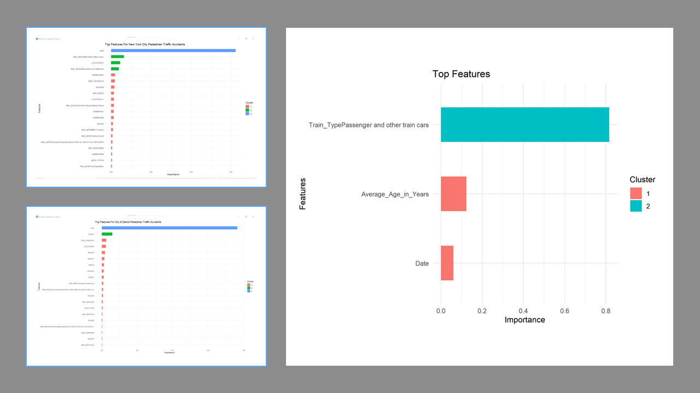

# **NHTSA Data Science Challenge**

To solve this data challenge we use XGBoost to create a submodel and impute missing value.
We then use XGBoost again to identify key features for each city that drive pedestrian crash data from the last five years of NHTSA datasets.

## Problem 1: 

Data Wrangling:

Explain which methods you would use to clean this sample dataset, and how you would go about applying them:

DOT Age and Availability of Amtrak and Locomotive Car Fleets -https://www.bts.gov/sites/bts.dot.gov/files/table_01_33_102020.xlsx
(Webpage: https://www.bts.gov/content/age-and-availability-amtrak-locomotive-and-car-fleets)

Data Joining:
Using any software (commercial and open source) you like, programmatically join the following two untidy sample datasets:
DOT Licensed drivers--Ratio of licensed drivers to population -https://www.fhwa.dot.gov/policyinformation/statistics/2014/xls/dl1c.xls.
DOT Licensed Drivers by State, Sex, and Age Group - https://www.fhwa.dot.gov/policyinformation/statistics/2014/xls/dl22.xls.

Provide an inline image or table showing between 5-10 sample rows of your joined dataset, along the source code used to complete the above task in plain text format.

## Problem 2

A senior policy official asks you to analyze why New York City and Detroit have different pedestrian crash outcomes over the last 5 years. Take Fatality Analysis Reporting System data from nhtsa.gov and compare and contrast Detroit with the New York City metropolitan area. What are the things you might analyze to understand what is different about fatal crash patterns in these cities? Explore the dataset and develop a hypothesis about why the two areas are different. You can suggest other data you might want to bring to the table in order to support your hypothesis.

Potential Resources
• Data Download: https://www.nhtsa.gov/es/node/97996/251 (you can download CSV or SAS files for each year)
• Explore data on your own: https://cdan.dot.gov/query
• Data User Guide (Analytical User's Manual): https://crashstats.nhtsa.dot.gov/Api/Public/ViewPublication/812827

### [GitHub Repo:](https://github.com/Jerome3590/NHTSA-Data-Science-Challenge)

